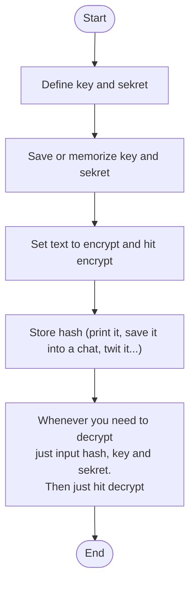
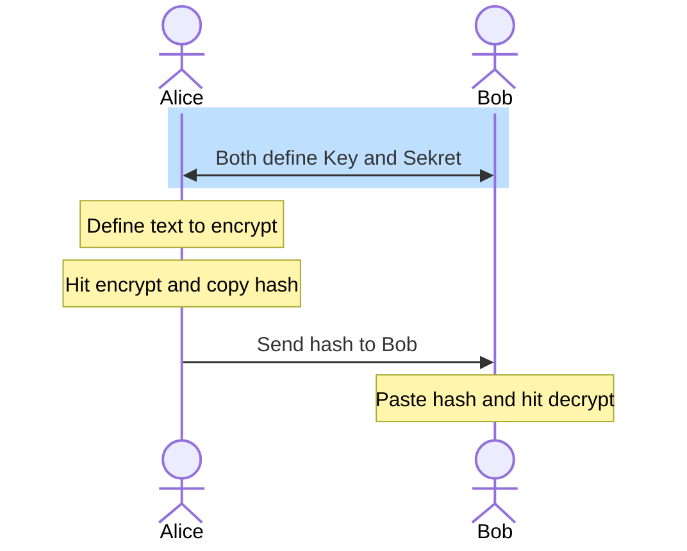
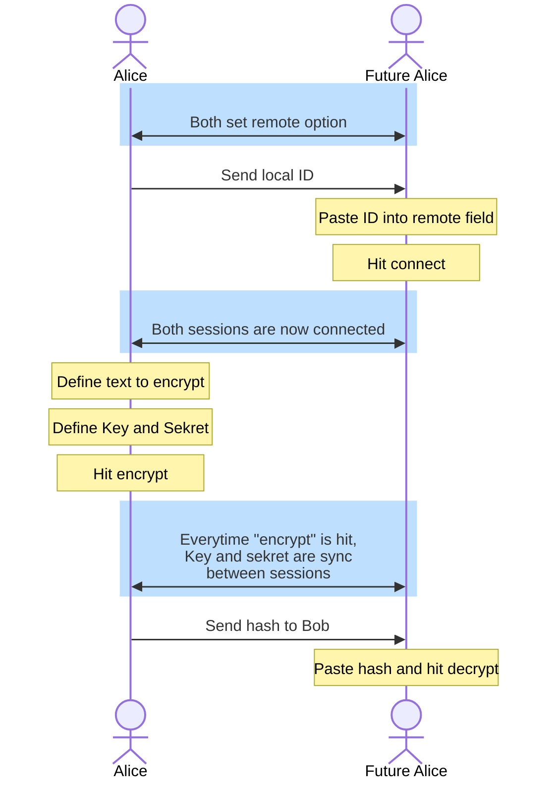

Sekreter
========

Yet another text encoder/decoder
This one uses no serverside at all, no data transfer, just you and your browser.
(you can even host it local and it works or use it without connection)

Uses [AES-CBC](https://en.wikipedia.org/wiki/Block_cipher_mode_of_operation) encryption method

## How to use
### For cold storage

### Sharing keys to another user

### Using p2p

## Changelog
- **1.0.2** - Add (optional) Peer to Peer support for easier way to share sekrets between two computers.  
This uses [peerjs](https://peerjs.com/) public server only for handling handshake, then all communications are P2P.  
- **1.0.1** - some minor patches  
- **1.0.0** - First release with mobile friendly and offline support
